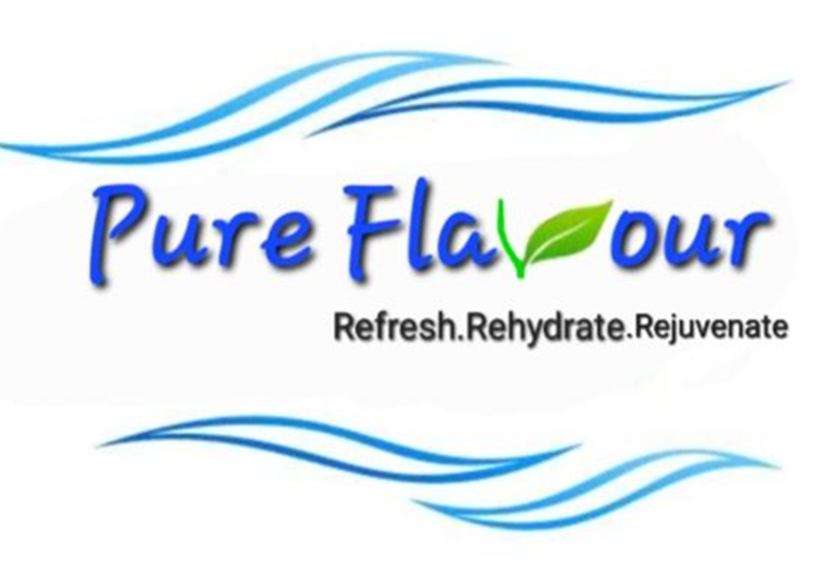

# 💧 Pure Flavour – Clean Water for Every Life

**Pure Flavour** is a social impact initiative aimed at providing **affordable**, **portable**, and **efficient water filtration solutions** to rural and underprivileged communities. This website serves as a platform to promote our mission, showcase the product, and enable easy communication with interested users, donors, and collaborators.

---

## 🌟 Key Sections

- **Hero Section** – Introduces our mission with a call to action.
- **About Us** – Our story and the vision behind Pure Flavour.
- **Features** – Highlights key product features like portability, affordability, and ease of use.
- **How It Works** – A step-by-step visual explanation of how the water filter functions.
- **Contact Us** – Form powered by [Formspree](https://formspree.io) for receiving inquiries.

---

## 🔧 Technologies Used

- **HTML5**  
- **CSS3**  
- **JavaScript**  
- **Formspree** (for handling form submissions)  
- **Responsive Design** (Mobile-first layout with hamburger menu)

---

Crafted with 🤍 by [Akriti](https://www.linkedin.com/in/akriti-kumari-116a03251/)  
